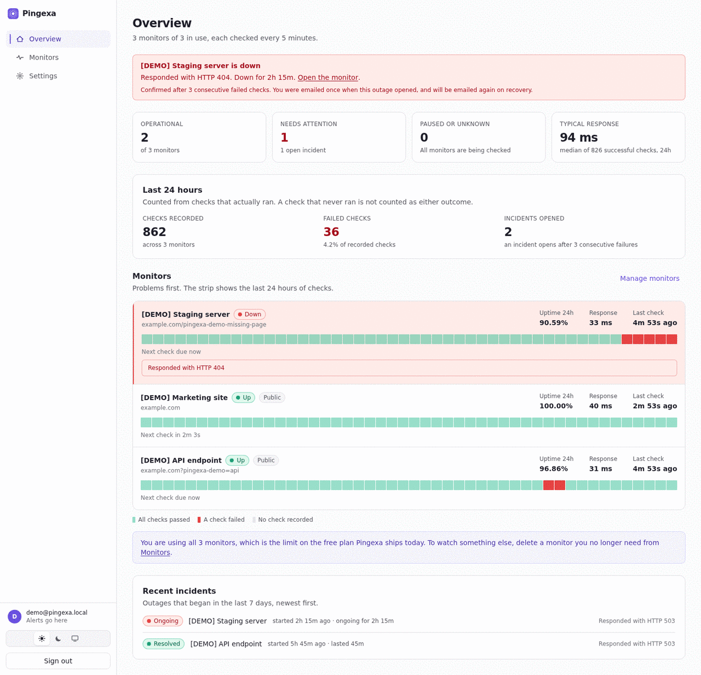
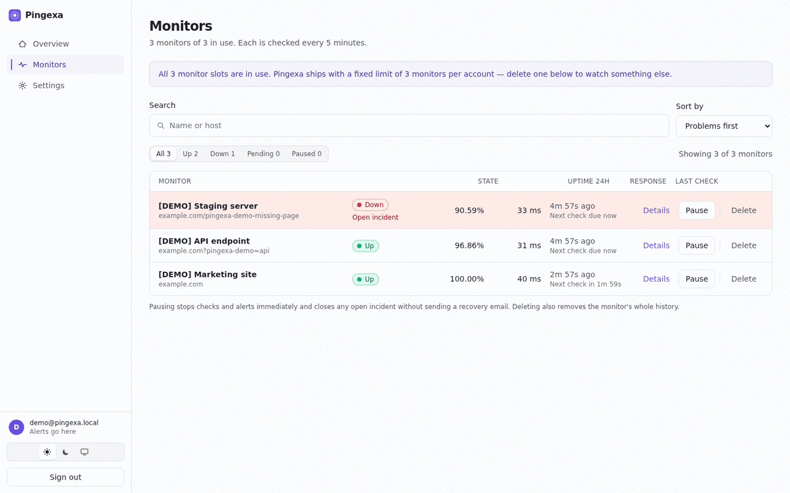
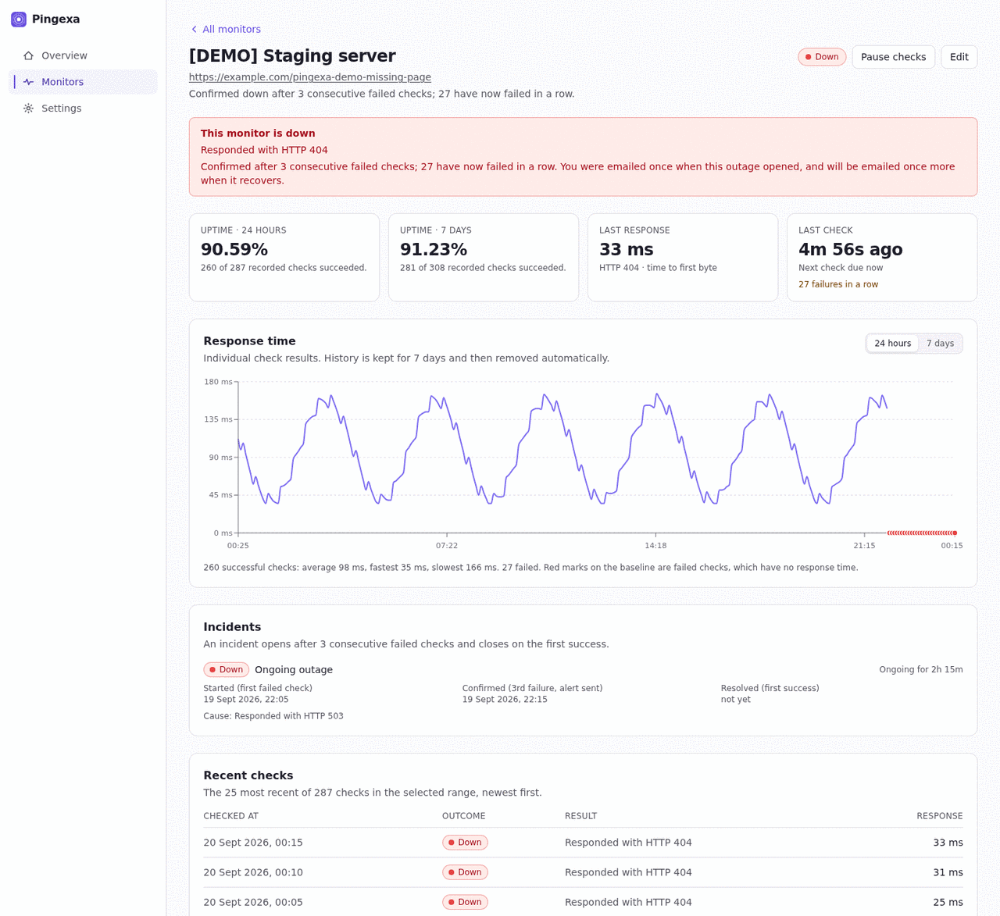
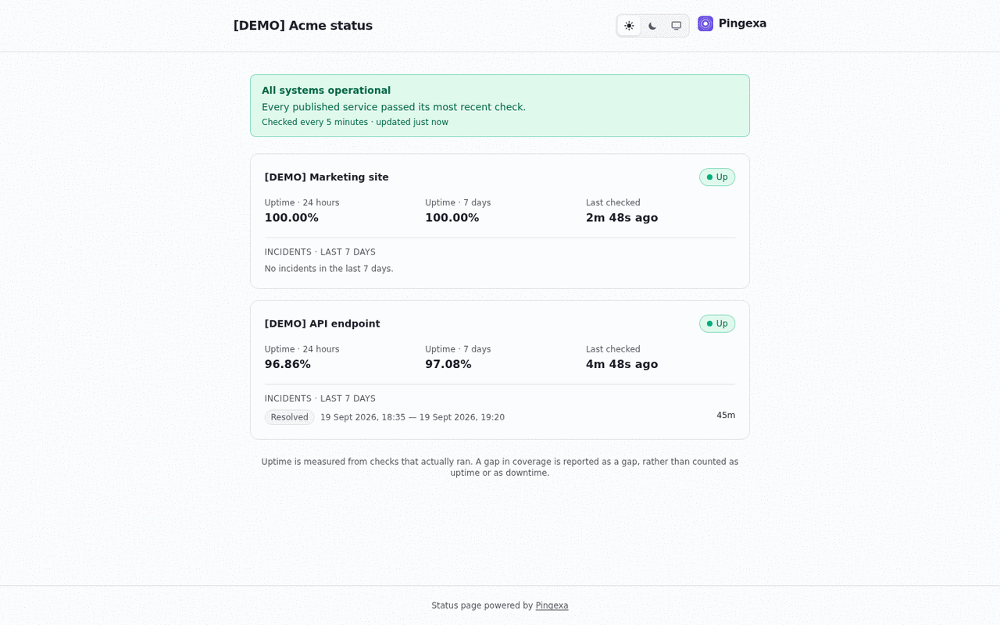
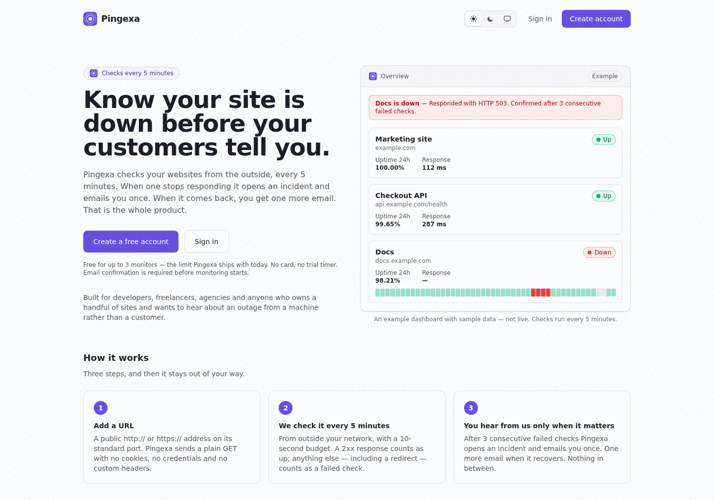

<div align="center">

# Pingexa

**Open-source uptime monitoring for websites and APIs — incident alerts,
response-time history, and public status pages.**

Pingexa checks your sites every five minutes from the outside, opens an
incident after three consecutive failures, emails you once when that happens
and once when they recover, and can publish a shareable status page.

[**Live app**](https://pingexa.parthavix.com) ·
[**Self-hosting**](docs/SELF_HOSTING.md) ·
[**Contributing**](CONTRIBUTING.md) ·
[**Report a bug**](https://github.com/Dharam-IN/Pingexa/issues/new?template=bug_report.yml) ·
[**Security**](SECURITY.md)

[](https://github.com/Dharam-IN/Pingexa/actions/workflows/ci.yml)
[](LICENSE)
[](https://www.typescriptlang.org/)
[](docs/SELF_HOSTING.md)
[](package.json)



</div>

---

## What Pingexa is

An uptime monitor that is deliberately small, and honest about what it knows.

You add up to three public HTTP or HTTPS URLs. Pingexa checks each one every
five minutes from outside your network, records every result, and tells you when
something breaks — by email, once, and once more when it comes back. That is the
whole product.

**Who it helps.** Developers, freelancers, agencies and small site owners who
run a handful of sites and would rather hear about an outage from a machine than
from a customer. If you need multi-region checking, an on-call rotation or SLA
reporting, Pingexa is the wrong tool and says so.

**What makes it different.** Most uptime tools quietly round in their own
favour. Pingexa does not have a code path that can:

* **count a check that never ran.** If monitoring stopped, that time is reported
  as *reduced coverage* — never as uptime, and never as downtime. Uptime is
  `—`, not `100%`, when nothing was recorded.
* **draw a gap as green.** A time bucket with no check is a third colour on the
  chart, and its response time is `null`, not `0`.
* **claim an email was delivered.** A provider's `250` means it was *accepted*.
  Pingexa has no bounce webhook, so the UI reads "Accepted" and the docs say
  alert delivery is at-least-once, never exactly-once.
* **be pointed at your private network.** Every hostname is resolved and checked
  against the public address ranges, and the connection is then pinned to that
  address so DNS cannot rebind under it. There is no setting that relaxes this.

---

## How it works

| | |
|---|---|
| **1. Add a URL** | A public `http://` or `https://` address on its standard port. Pingexa sends a plain `GET` — no cookies, no credentials, no custom headers. |
| **2. It checks every 5 minutes** | From outside your network, with a 10-second budget. A `2xx` counts as up; anything else — including a redirect — counts as a failed check. |
| **3. You hear from it only when it matters** | After **three consecutive failed checks** an incident opens and you get one email. One more when it recovers. Nothing in between. |

Three failures, not one, because a single slow response is not an outage — and a
monitor that emails about every blip gets muted, at which point it is worse than
useless. The streak counts *distinct scheduled checks*, so an internal retry can
never push your site to "down".

---

## Features

| | What it does | Detail |
|---|---|---|
| **HTTP/HTTPS monitoring** | Up to **3 monitors per account**, checked every **5 minutes** | Public URLs on standard ports (80/443). The limit is a database constraint, not a setting. |
| **Three-failure incident rule** | An incident opens on the **3rd consecutive failed scheduled check** and closes on the **first success** | Timestamps distinguish when the outage *began*, when Pingexa *confirmed* it, and when it *recovered*. |
| **Email alerts** | One **DOWN** email when an incident opens, one **RECOVERY** email when it closes | To the confirmed account address only. No digests, no third-party inbox. At-least-once, not exactly-once. |
| **Response-time history** | Every individual check result, for **7 days** | Time to first byte. Failures are marked separately from slow responses, so a gradual slowdown is visible before it becomes an outage. |
| **Coverage-aware uptime** | 24-hour and 7-day uptime, always reported next to its **coverage** | A missing check is never counted as up or down. `uptimePercent` is `null`, not `0` or `100`, when nothing ran. |
| **Incident history** | Every outage, with cause, duration and alert-delivery state | Kept for 90 days. Open incidents are never deleted. |
| **Public status page** | One optional page per account, at an unguessable 32-hex slug, with **per-monitor opt-in** | Publishes names, states, uptime and incident times — **never** your URLs, your email, status codes or error detail. `no-store` and `noindex`, so revoking it is immediate. |
| **Light / Dark / System** | A real three-option selector, persisted, with no flash on reload | Resolved before CSS sees it, so a toggle and a media query can never disagree. |
| **Honest by construction** | Gaps drawn as gaps, "Accepted" not "Delivered", no aggregate uptime number that would mean nothing | See [`docs/DECISIONS.md`](docs/DECISIONS.md) D12, D25, D27, D28. |
| **SSRF-hardened checks** | Resolve → filter → **pin the connection** | Every A/AAAA record checked against the IPv4 and IPv6 special-purpose registries. Redirects not followed, TLS always verified, **no off switch**. |
| **Self-hostable** | One `docker compose` stack, built from source | No registry account, no vendor lock-in, any SMTP provider. |

### What Pingexa does **not** do

Stated plainly, because a monitor you misunderstand is worse than none:

* **No multi-region checks.** Checks come from one place. A network problem
  between Pingexa and your site is indistinguishable from your site being down.
* **No redirect following.** A `3xx` is a failed check. Monitoring
  `http://example.com` when it redirects to HTTPS will report DOWN — monitor the
  final URL. ([Why](docs/DECISIONS.md))
* **No protocols other than HTTP/HTTPS.** No TCP, ping, DNS or port checks.
* **No SMS, Slack, webhooks or push.** Email only.
* **No manual "check now" button**, and no configurable interval. Five minutes,
  fixed.
* **No SSL-expiry, keyword or content checks.** Not yet — see the
  [roadmap](#roadmap).
* **No teams, organisations, billing or plans.** One account, three monitors.
* **No custom status-page domains or branding.**
* **No bounce handling or delivery telemetry.** A hard bounce after acceptance
  is invisible to Pingexa.
* **No self-service account deletion in the UI.** The cascade works; the button
  does not exist yet.
* **No mobile app, and no AI anything.**

---

## Screenshots

<table>
<tr>
<td width="50%">

**Overview** — ordered by urgency. An open outage gets a full-width band above
everything else; a healthy account reads in a second and you leave.


</td>
<td width="50%">

**Monitors** — search, state filters, sort, and the pause / edit / delete
actions.



</td>
</tr>
<tr>
<td width="50%">

**Monitor detail** — uptime beside its coverage, every check result for 7 days,
the incident timeline with all three timestamps, and alert delivery state.



</td>
<td width="50%">

**Public status page** — only what the owner chose to publish. No URLs, no
email address, no error detail.



</td>
</tr>
<tr>
<td colspan="2">

**Landing page**



</td>
</tr>
</table>

<sub>All screenshots use the seeded demo account — every monitor is prefixed
`[DEMO]` and points at `example.com`. Every screen also exists in a dark
theme.</sub>

---

## Quick start

Run it locally in about five minutes. Full instructions:
[`docs/DEVELOPMENT.md`](docs/DEVELOPMENT.md).

```bash
git clone https://github.com/Dharam-IN/Pingexa.git && cd Pingexa
npm install

cp .env.example .env
node -e "console.log(require('crypto').randomBytes(48).toString('base64url'))"
# paste that into SESSION_SECRET in .env

npm run dev:up            # Postgres, Redis and Mailpit in Docker
npm run migrate:deploy
npm run seed              # optional demo data, every name prefixed [DEMO]

npm run dev:api           # http://127.0.0.1:4000
npm run dev:worker        # a separate process, on purpose
npm run dev:web           # http://localhost:5173
```

Open <http://localhost:5173>, create an account, then read the confirmation
email in **Mailpit** at <http://127.0.0.1:58125>. Nothing is monitored until the
address is confirmed.

> Local mail never leaves your machine. `npm run dev:api` and `dev:worker` run a
> preflight that refuses to start if the environment file points SMTP anywhere
> other than a local mail catcher.

---

## Self-hosting

**→ [`docs/SELF_HOSTING.md`](docs/SELF_HOSTING.md)**

Everything is built from this source tree, so you need no container registry
account, no credentials belonging to anyone else, and no DNS you do not control.
About 1.5 GB of RAM and 10 GB of disk.

```bash
git clone https://github.com/Dharam-IN/Pingexa.git
cd Pingexa/deploy/selfhost
cp .env.example .env            # set your domain, secrets and SMTP

docker compose build
docker compose --profile migrate run --rm migrate   # must exit 0
docker compose up -d
```

Caddy obtains a Let's Encrypt certificate for your domain automatically.
Postgres and Redis sit on an `internal: true` network and publish no ports.
**Any standards-compliant SMTP provider works** — there is no provider SDK in
the codebase, so it is host, port, user and password.

You can rehearse the whole thing on a laptop first, with a local certificate and
Mailpit, using no domain and no mail account
([§5](docs/SELF_HOSTING.md#5-try-it-locally-first-optional-recommended)).

---

## Architecture

**→ [`docs/ARCHITECTURE.md`](docs/ARCHITECTURE.md)** for diagrams and the
reasoning.

```
Browser ──► Caddy (TLS, one origin) ──┬──► nginx ──► the built SPA
                                      └──► API ──┬──► PostgreSQL ◄── Worker ──► monitored sites
                                                 └──► Redis      ◄──         └──► SMTP provider
```

| Process | Responsibility |
|---|---|
| **API** | HTTP only. Sessions, monitor CRUD, status pages, health. Enqueues email; runs no consumers and no scheduler. |
| **Worker** | The scheduler tick, the check consumer, the email consumer, the alert outbox pass, retention cleanup. |
| **Web** | A static bundle. No server-side runtime. |

Three structural choices carry most of the weight:

1. **PostgreSQL is the scheduling source of truth; Redis only transports jobs.**
   Every monitor carries `nextCheckAt`, and the worker claims due monitors with
   one atomic `UPDATE … FOR UPDATE SKIP LOCKED`. A full Redis flush loses at
   most the in-flight jobs; the next tick re-derives everything from Postgres,
   and several workers are safe with no coordination.
2. **Correctness lives in database constraints, not application checks.** The
   3-monitor cap is a unique `(userId, slot)` plus a `CHECK`. Idempotent check
   processing is a unique `(monitorId, scheduledFor)`. One alert per incident is
   a unique `(incidentId, kind)`. One open incident per monitor is a partial
   unique index. Queues are at-least-once, so correctness must not depend on
   exactly-once.
3. **The API and the worker share one image and differ only by `command`.**
   Either can be restarted or scaled without the other.

---

## Tech stack

| Layer | Choice |
|---|---|
| Frontend | React 19 · Vite 8 · React Router · Tailwind 4 · Recharts |
| API | Node ≥ 22.12 · Express 5 · TypeScript 5.9 · zod |
| Worker | The same codebase, a separate entrypoint · BullMQ |
| Database | PostgreSQL 16+ · Prisma 7 with the `pg` driver adapter · committed migrations |
| Queues & limits | Redis 7 (`noeviction`, AOF) |
| Auth | Argon2id · opaque server-side sessions (stored as an HMAC) · CSRF double-submit + origin allowlist |
| Outbound checks | undici, with a resolve-filter-pin SSRF guard |
| Email | nodemailer over plain SMTP — any provider |
| Edge | Caddy (TLS, one origin) · nginx (static SPA) |
| Tests | Vitest (unit + integration) · Playwright (end-to-end, two viewports) |
| CI | GitHub Actions — lint, typecheck, unit, integration against real Postgres and Redis, build |

Monorepo on npm workspaces with one root lockfile. `packages/shared` holds the
zod schemas and response types that **both** sides import, so the HTTP contract
cannot silently drift.

---

## Repository layout

```
apps/api/              Express API and the worker. Two entrypoints, one codebase.
  src/config/          Environment parsing and cross-field production safety rules.
  src/domain/          Auth, sessions, tokens, monitors, uptime, status pages.
  src/monitoring/      SSRF guard, check executor, scheduler, incident state machine.
  src/http/            Express app, middleware, routes.
  src/worker/          Queue job handlers and the alert outbox pass.
  prisma/              Schema + committed migrations. Never edit an applied one.
  tests/               unit/ (pure logic) and integration/ (real Postgres + Redis).
apps/web/              React + Vite SPA.
  src/components/      UI kit (ui.tsx), chart, check strip, app shell.
  src/pages/           One file per route.
  e2e/                 Playwright, against the whole running stack including Mailpit.
packages/shared/       Types, zod schemas and product constants used by both sides.
deploy/                Dockerfiles, proxy config, maintainer deploy scripts.
deploy/selfhost/       The community self-hosting stack — build from source.
docs/                  Architecture, development, self-hosting, API, decisions.
scripts/               Development mail guard, fresh-setup verification.
.github/workflows/     CI, and the pipeline that ships main to the maintainer's server.
```

---

## Commands

```bash
npm install                # installs, generates the Prisma client, builds @pingexa/shared
npm run dev:up             # Postgres, Redis, Mailpit (development only)
npm run dev:down           # stops them, KEEPS the volumes
npm run migrate:deploy     # apply committed migrations
npm run migrate:dev        # create a migration after editing the schema
npm run seed               # demo data, every name prefixed [DEMO]

npm run dev:api            # API on :4000
npm run dev:worker         # scheduler + queue consumers
npm run dev:web            # SPA on :5173, proxies /api to :4000
npm run dev:check          # run the development mail guard on its own

npm run build              # shared, api, web
npm run start:api          # run the built output
npm run start:worker
```

### Testing

```bash
npm run lint
npm run typecheck
npm run test:unit          # pure logic; no Postgres, no Redis, no network
npm run test:integration   # real Postgres + Redis, disposable `pingexa_test` database
npm run test:e2e           # Playwright against the whole stack including Mailpit
npm run build

./scripts/verify-fresh-setup.sh   # build a fresh database from committed migrations only
```

The first five are exactly what CI runs, so green here is green there. The
end-to-end suite is not in CI — it needs the whole stack and runs serially
across two viewports. `npx playwright install chromium` once, first.

---

## Documentation

| Document | What it covers |
|---|---|
| [`docs/ARCHITECTURE.md`](docs/ARCHITECTURE.md) | How the pieces fit together, with diagrams. Scheduling, incident transitions, the email outbox, the public/private boundary. |
| [`docs/DEVELOPMENT.md`](docs/DEVELOPMENT.md) | Running it locally, the test suites, keeping development mail in Mailpit. |
| [`docs/SELF_HOSTING.md`](docs/SELF_HOSTING.md) | Running your own: requirements, secrets, SMTP, HTTPS, backups, upgrades, troubleshooting. |
| [`docs/API.md`](docs/API.md) | The HTTP contract, plus check, uptime and incident semantics. |
| [`docs/DECISIONS.md`](docs/DECISIONS.md) | Why the non-obvious things are the way they are. 29 entries. |
| [`docs/DATA_AND_PRIVACY.md`](docs/DATA_AND_PRIVACY.md) | Exactly what is stored, where it goes, how long it lives — and the hosted-service legal gap. |
| [`docs/HANDOVER.md`](docs/HANDOVER.md) | Operating it, the acceptance checklist, and §13: known limitations. |
| [`docs/PROJECT_PLAN.md`](docs/PROJECT_PLAN.md) | The fixed V1 scope and its acceptance criteria. |
| [`docs/PROGRESS.md`](docs/PROGRESS.md) | Current state, verification results, and the next action. |
| [`docs/DEPLOYMENT.md`](docs/DEPLOYMENT.md) | The **maintainer's** production pipeline. Not the self-hosting path. |
| [`CLAUDE.md`](CLAUDE.md) | The rules this codebase holds itself to. |

---

## Roadmap

No dates. This is a side project maintained by one person, and anything below
may be built in a different order or not at all.

### Done

- [x] HTTP/HTTPS website monitoring
- [x] Five-minute scheduling, durable and reconciling, with Postgres as the source of truth
- [x] Three-consecutive-failure incident threshold
- [x] DOWN and RECOVERY email alerts, with persisted delivery state
- [x] Response-time and check history, 7-day retention
- [x] Coverage-aware uptime that never counts a missing check
- [x] Public status pages with per-monitor opt-in
- [x] Docker-based deployment, and an independent self-hosting path
- [x] Light / Dark / System themes
- [x] MIT licence and the open-source foundation

### Being considered

Ordered roughly by how often the problem comes up, not by commitment.

- [ ] **SSL certificate expiry monitoring** — the TLS handshake already happens
      on every check; recording the expiry date and warning ahead of time is a
      small addition with a real payoff.
- [ ] **Keyword / content checks** — "the page returned 200 but the word
      *Checkout* is gone" is an outage a status-code check misses.
- [ ] **Additional notification channels** — a webhook first, since Slack,
      Discord and PagerDuty all accept one.
- [ ] **Bounce processing and provider delivery telemetry** — the honest fix for
      "accepted is not delivered". Needs a provider webhook.
- [ ] **A manual "check now" button**, with strict abuse controls — it is a
      button that makes a stranger's server send a request, so the rate limiting
      has to come first.
- [ ] **Longer or configurable retention** — only if the product direction
      changes; today 7 days is a deliberate simplification.
- [ ] **Self-service account deletion** — the cascade already works correctly;
      this is a UI and a confirmation flow.

Ideas are welcome — [open a feature
request](https://github.com/Dharam-IN/Pingexa/issues/new?template=feature_request.yml)
and describe the problem before the solution.

### Not planned

Billing · plans · organisations or teams · custom status-page domains · SMS ·
AI features · mobile apps · multi-region checks · protocols other than
HTTP/HTTPS. These are out of scope by design, and a pull request implementing
one will be declined however good the code is.

---

## Known limitations

The ones most likely to surprise you. [`docs/HANDOVER.md`](docs/HANDOVER.md)
§13 has the full list with reasoning.

1. **Redirects are not followed.** A `3xx` is a failed check. Following them
   safely means re-running the whole SSRF guard and address pinning at every
   hop; not following them is far easier to audit. The UI tells you to monitor
   the final URL.
2. **Alert delivery is at-least-once, not exactly-once.** One alert *row* per
   incident is guaranteed by a unique index; the number of SMTP messages for
   that row is not, because the send happens outside the transaction. A
   duplicate "your site is down" is treated as less harmful than a missed one.
3. **Checks come from one place.** Pingexa cannot tell "your site is down" apart
   from "my server cannot reach your site".
4. **Coverage counts paused time as missing.** Pingexa keeps no pause history,
   so a monitor paused for most of a window reports low coverage. That is the
   honest answer, but it is not "we were watching and it was fine".
5. **Check dispatch is granular to the scheduler tick.** A check can fire up to
   15 seconds late by default.
6. **No bounce handling.** A permanent SMTP failure is recorded and shown, but
   Pingexa consumes no bounce webhooks and suppresses no future sends.
7. **No self-service account deletion.**
8. **One status page per account**, no custom domain, no branding controls.

---

## Contributing

**→ [`CONTRIBUTING.md`](CONTRIBUTING.md)**

Bug fixes with a reproduction: open a pull request. Anything that adds
behaviour, an endpoint, a dependency or a schema change: open an issue first.

A few rules are stricter than usual, and worth knowing before you write code:

* **The SSRF guard has no off switch**, and a patch that adds one will be
  rejected. An ESLint rule fails the build if it is wired to configuration.
* **Correctness lives in database constraints.** If you find yourself writing
  `count()` then `insert`, stop.
* **A missing check is never `0%` or `100%`**, and never a green bar.
* **Never log or store a response body, a token, a password or a session
  value.** The logger redacts by key name.
* **Say "accepted", not "delivered".**

By participating you agree to the [Code of Conduct](CODE_OF_CONDUCT.md).
Contributions are accepted under the MIT licence — no CLA, no DCO.

- [Report a bug](https://github.com/Dharam-IN/Pingexa/issues/new?template=bug_report.yml)
- [Request a feature](https://github.com/Dharam-IN/Pingexa/issues/new?template=feature_request.yml)
- [Getting help](SUPPORT.md)

---

## Security

**Do not open a public issue for a security problem.** Use GitHub's private
vulnerability reporting from the repository's **Security** tab, and read
[`SECURITY.md`](SECURITY.md) first — it lists what is in scope, what the project
already guarantees, and the known non-issues.

Pingexa makes outbound requests to URLs strangers supply, so the protections
around that are the part most worth your attention.

---

## The hosted instance

<https://pingexa.parthavix.com> runs this code and is operated by the
maintainer. It is a personal deployment rather than a commercial service: no
uptime guarantee, no support commitment, and no compensation for a missed alert.

It does not yet publish a Privacy Policy or Terms of Service. That gap is
recorded openly, with a full data inventory, in
[`docs/DATA_AND_PRIVACY.md`](docs/DATA_AND_PRIVACY.md). It affects the hosted
service, not the source licence — and if you would rather not depend on someone
else's side project, self-host it. That is what the MIT licence is for.

---

## License

[MIT](LICENSE) © 2026 Dharamraj Yadav

Provided as-is, without warranty. Running an instance exposed to the internet is
your responsibility.
