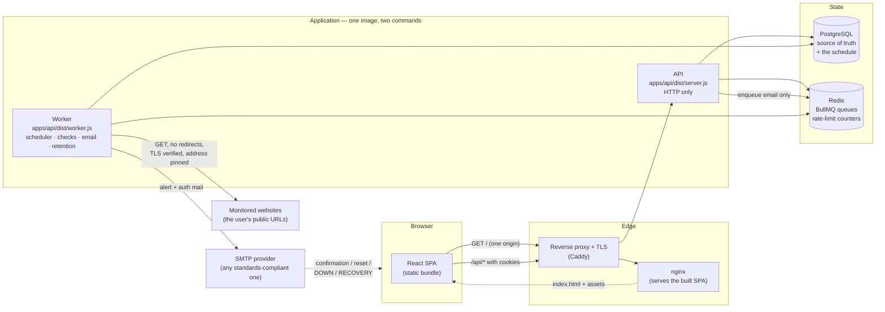
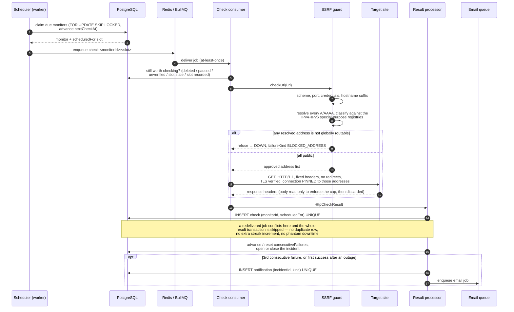
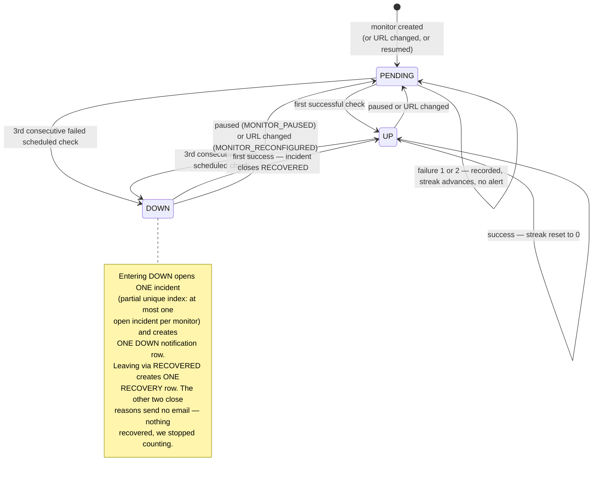
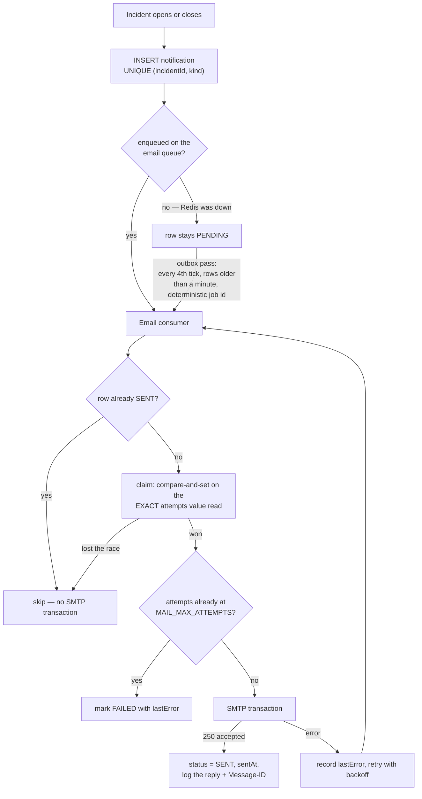
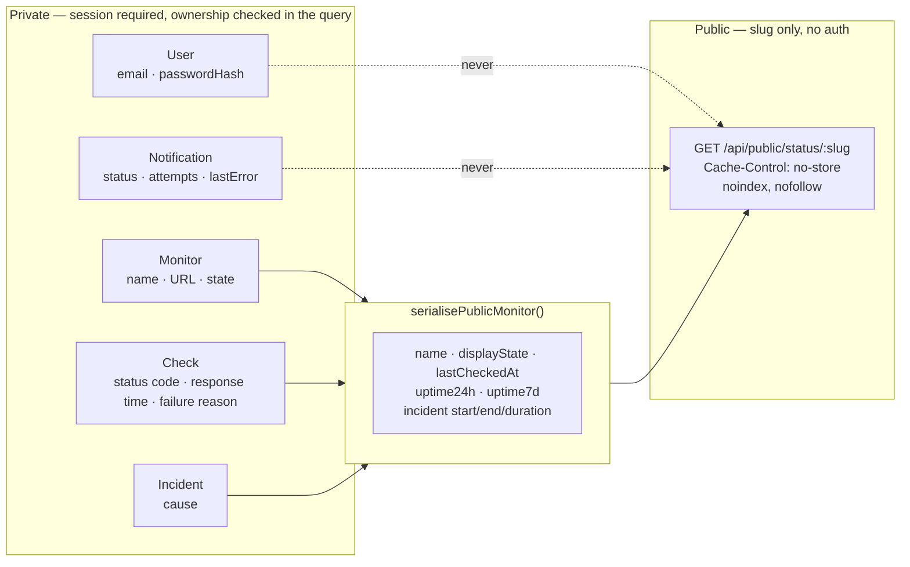
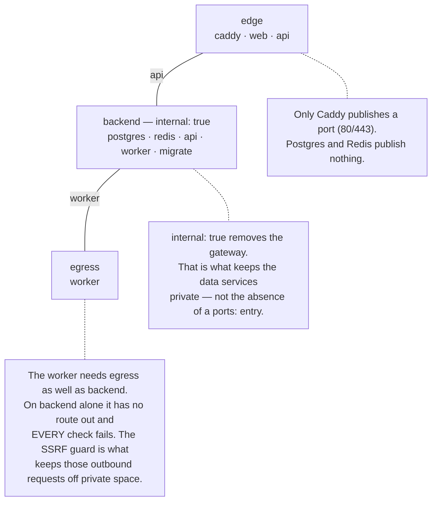

# Pingexa — Architecture

How the pieces fit together, and which properties each one is responsible for.

This describes the system as it is built, not as it might be. Where a decision
looks arbitrary, [`DECISIONS.md`](DECISIONS.md) says why; where behaviour is
user-visible, [`API.md`](API.md) is the contract.

---

## 1. The shape of it

Three processes you run, three you depend on, and one thing you point at.



| Component | What it is | What it is responsible for |
|---|---|---|
| **Web** | `apps/web` — React 19 + Vite, built to a static bundle | Every screen. It has no server-side runtime; `nginx` just serves files. |
| **API** | `apps/api/src/server.ts` — Express 5 | HTTP only: sessions, monitor CRUD, status pages, the read-only aggregates, health. It **enqueues** email jobs and runs **no** consumers and **no** scheduler. |
| **Worker** | `apps/api/src/worker.ts` — same codebase, different entrypoint | The scheduler tick, the check queue consumer, the email queue consumer, the alert outbox pass, and retention cleanup. |
| **PostgreSQL** | 17 in the shipped stacks, 16+ supported | Everything of value, **including the schedule**. |
| **Redis** | 7, `maxmemory-policy noeviction`, AOF on | BullMQ job transport and rate-limit counters. Nothing durable lives only here. |
| **SMTP** | any provider that speaks SMTP | Delivery. Pingexa has no provider SDK — it is host, port, user, password. |
| **Reverse proxy** | Caddy in the shipped stacks | TLS, and putting the SPA and the API on **one origin**. |

**The API and the worker are independent.** Either can be restarted, scaled or
stopped without the other, and neither is required for the other to start. They
share one image and differ only by `command`
([D2](DECISIONS.md)).

### Why one origin

`apps/web/src/lib/api.ts` falls back to an empty API base, so the browser calls
`/api` on whatever origin served the page. That makes the built bundle
environment-independent — one image works on any hostname and can be rolled
back without a rebuild — and it keeps the session cookie first-party, which is
why `COOKIE_SAMESITE=Lax` is sufficient.

---

## 2. Scheduling: Postgres decides, Redis only carries

This is the single most important structural choice in the system
([D4](DECISIONS.md)).

Every monitor row carries `nextCheckAt`. The worker ticks on a plain
`setInterval` (`SCHEDULER_TICK_MS`, default 15s) and claims due monitors with
**one statement**:

```sql
UPDATE monitors
   SET "nextCheckAt" = ...
 WHERE id IN (SELECT id FROM monitors WHERE "nextCheckAt" <= now() ... FOR UPDATE SKIP LOCKED)
RETURNING id, <the slot just claimed>;
```

Because the select and the update are one statement, two ticks — or two worker
processes — can never claim the same slot. Then one BullMQ job is enqueued per
claimed slot, with a deterministic job id.

What this buys:

* **A full Redis flush loses at most the in-flight jobs.** The next tick
  re-derives everything from Postgres.
* **Several workers are safe** without any coordination between them.
* **"Which code is running the schedule" has one answer**, and it is a row in a
  table you can query.

The cost: dispatch is granular to the tick, so a check can fire up to
`SCHEDULER_TICK_MS` late. For a 5-minute monitor that is not worth solving.

Three behaviours round it out, all in `apps/api/src/monitoring/scheduler.ts`:

* **Catch-up.** A monitor more than three intervals behind is re-based onto the
  present rather than replayed slot by slot. A restart after an outage produces
  one fresh check per monitor, not a backlog that would hammer the monitored
  sites and look like a burst of failures.
* **Reconciliation.** At startup and every fourth tick, any monitor that
  *should* be scheduled but is not (`nextCheckAt IS NULL`, unpaused, verified
  account) is put back on the schedule.
* **Every reason not to check is evaluated before the request goes out:**
  monitor deleted, monitor paused, account no longer verified, slot too old,
  slot already recorded.

---

## 3. A check, end to end



### How a response is graded

`GET` only, over HTTP/1.1, one connection per check. Exactly these headers:
`user-agent`, `accept: */*`, `accept-encoding: identity`,
`cache-control: no-cache`, `connection: close`, plus `host`. No cookies, no
`Authorization`, nothing user-supplied.

| Result | Outcome | `failureKind` |
|---|---|---|
| `2xx` | UP | — |
| `3xx` | DOWN | `REDIRECT` — redirects are **not** followed ([D7](DECISIONS.md)) |
| `4xx`, `5xx` | DOWN | `HTTP_ERROR` |
| No response within `MONITOR_TIMEOUT_MS` | DOWN | `TIMEOUT` |
| DNS lookup failed | DOWN | `DNS_ERROR` |
| TCP connect/reset failed | DOWN | `CONNECTION_ERROR` |
| Certificate or handshake failed | DOWN | `TLS_ERROR` |
| Resolved to a non-public address | DOWN | `BLOCKED_ADDRESS` |
| URL no longer passes the shape rules | DOWN | `INVALID_URL` |
| Body exceeded `MONITOR_MAX_RESPONSE_BYTES` | DOWN | `RESPONSE_TOO_LARGE` |

`responseTimeMs` is the time to response **headers** — time to first byte —
which is the figure an uptime check is about.

### The SSRF guard

`apps/api/src/monitoring/urlGuard.ts` and `ipRanges.ts`. The order matters:
**parse, resolve, filter, then pin** ([D8](DECISIONS.md)).

Validating DNS and then letting the socket re-resolve is the classic DNS
rebinding hole. The request is performed through an `undici.Agent` whose
`connect.lookup` can only return the pre-approved addresses, so the connection
cannot land anywhere else. TLS still verifies against the original hostname.

If **any** resolved address is non-public the whole hostname is refused: a host
that answers with both a public and a private address is not monitorable.

**There is no environment variable or config key that weakens any of this.**
`createUrlGuard()` takes an explicit policy object and the production factory
always passes the strict one; tests that need a loopback fixture construct
their own. An ESLint rule fails the build if the guard is ever wired to `env`
([D9](DECISIONS.md)).

---

## 4. Incident state transitions



The streak counts **distinct scheduled slots**, never delivery attempts
([D6](DECISIONS.md)). `Monitor.consecutiveFailures` is advanced only inside the
transaction that successfully inserts a *new* `(monitorId, scheduledFor)` row,
so a queue retry or redelivery of the same slot cannot push a monitor to DOWN.

### The timestamps mean three different things

| Field | Meaning |
|---|---|
| `startedAt` | `checkedAt` of the **first** failed check in the streak — when the outage began |
| `detectedAt` | `checkedAt` of the **third** failure — when Pingexa confirmed it and alerted |
| `resolvedAt` | `checkedAt` of the **first success** afterwards; `null` while open |

Collapsing those into one timestamp would lose the distinction between when a
site broke and when a monitor with a three-failure threshold could honestly say
so. `PENDING` also appears as a display state only — `PAUSED` and `STALE` exist
in `displayState` and never in the stored `state`.

### Correctness by constraint, not by application check

| Rule | Enforced by |
|---|---|
| 3 monitors per account | unique `(userId, slot)` + `CHECK (slot BETWEEN 0 AND 2)` |
| Idempotent check processing | unique `(monitorId, scheduledFor)` |
| One DOWN and one RECOVERY alert per incident | unique `(incidentId, kind)` |
| One open incident per monitor | partial unique index `WHERE "resolvedAt" IS NULL` |

A `count()` followed by an `insert` can be beaten by concurrent requests under
any isolation level short of serializable. A constraint cannot
([D5](DECISIONS.md), [D14](DECISIONS.md)).

---

## 5. Email: an outbox, and what "sent" actually means



Three things bound how many SMTP messages one alert can cause
([D17](DECISIONS.md), [D19](DECISIONS.md), [D20](DECISIONS.md)):

1. A row already marked `SENT` is skipped without sending.
2. The claim is a **compare-and-set on the exact `attempts` value read**, so two
   simultaneous handlers cannot both send. (The obvious
   `WHERE status = 'PENDING'` claim excludes nobody — the row stays `PENDING`
   for the duration of the send.)
3. The attempt budget is taken from the **row's persisted `attempts`**, not from
   the queue job's counter, so re-creating the job cannot restart the budget.

**What this is and is not.** The unique index bounds alert *intents* — at most
one DOWN row and one RECOVERY row per incident. It says nothing about how many
SMTP messages leave the process for that row, because the send happens outside
the transaction. Two windows can still put a second copy in a mailbox: the
worker dying between the SMTP accept and the `SENT` write, and an ambiguous
failure where a socket timeout after `DATA` means the message *was* accepted but
the `250` never arrived. Both are retried on purpose — a duplicate "your site is
down" is less harmful than a missed one.

**So: at most one alert row per incident and kind, at most `MAIL_MAX_ATTEMPTS`
SMTP transactions for that row, and at-least-once delivery.** Never
"exactly-once".

And `status = SENT` means **the provider accepted the message**. There is no
bounce webhook and no delivery telemetry, so that is the strongest claim the
system is entitled to make — which is why the interface reads "Accepted", never
"Delivered" ([D25](DECISIONS.md)).

---

## 6. The public / private boundary

Two things are public: the marketing pages, and a status page whose owner has
explicitly published it.



The projection is **a single function** that never receives or emits the
monitored URL, the owner's email, HTTP status codes, failure reasons, or the
slug itself. Only monitors with `isPublic: true` are included, and only while
the page itself is published.

Three supporting decisions:

* **`Cache-Control: no-store`** ([D18](DECISIONS.md)). The slug is the only
  access control, so unpublishing the page or rotating the slug must take effect
  at once. A `max-age=30` response meant a browser kept seeing a revoked page
  for up to 30 seconds — found by the end-to-end test for slug rotation.
* **`noindex, nofollow`** while a status page is open ([D29](DECISIONS.md)). An
  indexed status page would outlive its own revocation in someone else's cache.
  The tag is added on mount and removed on unmount, so it never leaks onto the
  marketing pages, which *do* want to be indexed.
* **Requesting another user's resource returns `404`**, never `403`, so an id
  cannot be probed for existence.

`Notification.lastError` is never projected anywhere, not even to the owner: it
is an SMTP diagnostic that can carry provider hostnames and raw server replies,
and the interface's question — "did this arrive" — is answered by `status` and
`attempts` ([D27](DECISIONS.md)).

---

## 7. Honesty about missing data

An uptime product has one easy way to lie: treat "we did not look" as "it was
fine". Pingexa does not have a code path that can do that.

```
uptimePercent   = up / (up + down)      over checks ACTUALLY RECORDED in the window
coveragePercent = recorded / expected   expected = window ÷ interval, from max(createdAt, windowStart)
partialData     = coveragePercent < 90
```

* A check that never ran counts as neither up nor down.
* `uptimePercent` is **`null`** — rendered `—`, never `0%` and never `100%` —
  when nothing was recorded.
* A monitor whose newest check is older than three intervals is reported with
  `monitoringStale: true` and displayed as **Unknown**, with its last known
  state shown separately. That is how a worker outage surfaces instead of
  silently freezing a green tick.
* The same rule applies to pictures ([D28](DECISIONS.md)): the overview buckets
  24 hours into a fixed 48-bucket grid server-side, and a bucket in which
  nothing ran is drawn in a **third colour** with `avgResponseTimeMs: null` —
  never green, and never a zero, which would draw as an instantaneous response.
* There is deliberately **no aggregate uptime percentage** for an account, and
  the overview reports a **median** response time rather than a mean: one
  ten-second timeout drags a mean far enough to make a healthy account look slow
  ([D27](DECISIONS.md)).

The tradeoff is two numbers to explain instead of one. The UI labels both.

---

## 8. Request path and security layers

An authenticated write travels through, in order:

1. **Reverse proxy** — TLS terminates; `X-Forwarded-For` is set. The API's
   `TRUST_PROXY_HOPS` must equal the real number of proxies: too low and every
   rate limit keys on the proxy's address, too high and a client can forge the
   header and bypass them.
2. **helmet** headers, a 32 kB JSON body limit, and an `x-request-id` that is
   accepted from the inbound header when present and echoed on the response.
3. **CORS**, restricted to `TRUSTED_ORIGINS`, no wildcard.
4. **Rate limiting**, backed by Redis so limits hold across API instances. If
   Redis is unavailable the limiter allows the request rather than failing it,
   and logs that it did. Buckets and keys are in [`API.md`](API.md).
5. **CSRF** — a double-submit token plus an origin allowlist on every non-GET
   ([D11](DECISIONS.md)). The `pingexa_csrf` cookie is deliberately *not*
   httpOnly because the client must read it.
6. **Session** — an opaque 32-byte token in an httpOnly cookie, stored only as
   an HMAC ([D10](DECISIONS.md)). Instant revocation matters more here than
   statelessness, and the API already has a database on every request.
7. **Ownership**, scoped **in the query** rather than checked afterwards.

One subtlety worth knowing about: **a browser's first request to Pingexa may be
a write.** Opening an emailed confirmation or reset link on a device that has
never loaded the app makes `POST /api/auth/verify-email` its first ever request
— no cookie, so no token, so `403`. The API client bootstraps the token with one
safe `GET` for exactly this reason. The end-to-end suite cannot catch this,
because it always navigates the SPA first ([D23](DECISIONS.md)).

### Accounts

Argon2id (19 MiB, 2 iterations). Opaque 32-byte session tokens stored only as an
HMAC. Single-use, expiring verification (24h) and reset (1h) tokens, also stored
only as an HMAC, with a new token invalidating the previous one. A completed
reset revokes every session; a password change revokes every *other* session.
Login answers identically for a wrong password and an unknown address, and costs
a password verification either way so timing does not reveal existence.

### Logging

Structured JSON via pino. Passwords, hashes, tokens, cookies, `Authorization`
headers, status-page slugs and response bodies are **redacted by key name** — so
renaming a field to get around the redactor is a bug, not a workaround.

---

## 8a. Operational surfaces

| Endpoint | Use for | Behaviour |
|---|---|---|
| `GET /api/health` | **liveness** | Always 200 while the process is up. Touches no dependency, so a database blip cannot make an orchestrator kill a healthy process. Reports the running version. |
| `GET /api/ready` | **readiness** | 200 when Postgres **and** Redis answer; 503 otherwise, naming which failed. |
| `GET /api/meta` | client bootstrap | The product's fixed rules, so the SPA never hardcodes them. Also issues the CSRF cookie. |

The worker exposes **no HTTP endpoint**, by design. Judge it by process liveness
and by its logs; a worker that has stopped working shows up in the product as
monitors reporting `monitoringStale`, which the UI renders as **Unknown**.

### Startup dependencies

| Process | Postgres | Redis | SMTP |
|---|---|---|---|
| API | starts without it and reports `/api/ready` as degraded | degrades readiness, does **not** fail requests | not used |
| Worker | **required** — exits if unreachable at startup | required | required to deliver; failures are retried and recorded, and never block monitoring |

### Shutdown

* **API** — stops accepting connections, drains in-flight requests, closes idle
  keep-alive sockets, releases the queue, Redis and Postgres handles. Hard exit
  at 15s; give it ≥ 20s of grace.
* **Worker** — stops the scheduler and retention timers, then `Worker.close()`,
  which **waits for in-flight jobs**, so a check in progress records its result
  rather than being abandoned. Hard exit at 30s; give it ≥ 35s of grace.

### Persistence

* **Postgres must be durable.** It holds everything of value *and* the schedule.
* **Redis should be durable but is recoverable.** Losing it loses at most the
  in-flight checks: the next tick re-derives from Postgres, and pending alerts
  are re-enqueued by the outbox. It **must** run `maxmemory-policy noeviction` —
  evicting BullMQ keys corrupts queues, silently.
* **Nothing is written to local disk** by either process. No uploads, no cache,
  no session files, so the application containers can be entirely ephemeral.

### Retention

Every `RETENTION_INTERVAL_MS` (default 1h), plus once ten seconds after startup:
checks older than `CHECK_RETENTION_DAYS` (7), resolved incidents older than
`INCIDENT_RETENTION_DAYS` (90), expired and revoked sessions, and spent auth
tokens. **Open incidents are never deleted**, however old.

---

## 9. The front end

React 19 + Vite, React Router, Recharts, Tailwind 4. One bundle, no server-side
rendering, no data fetching framework — a small polling hook over `fetch`.

**Routes.** `/` landing · `/signup` · `/login` · `/verify-email` ·
`/forgot-password` · `/reset-password` · `/status/:slug` (public) ·
`/app` overview · `/app/monitors` · `/app/monitors/:id` · `/app/settings`.

The signed-in shell is a sidebar from `lg` up and a drawer below it, with
exactly three destinations. A rail was chosen over a top bar because the route
structure is *fixed* — teams, billing and regions are all out of scope — so it
never needs an overflow menu ([D26](DECISIONS.md)).

**Theming is attribute-driven** ([D21](DECISIONS.md)). `<html>` carries a
resolved `data-theme="light"|"dark"` plus the raw
`data-theme-preference="light"|"dark"|"system"`. `system` is resolved to one of
the two *before* CSS sees it, by a synchronous bootstrap script in
`apps/web/index.html` and then by `ThemeContext`, so the compiled stylesheet
contains **zero** `prefers-color-scheme` rules and a media query can never
disagree with the selector. Nothing caches the resolved theme; the OS setting is
read through `useSyncExternalStore`, which reads during render.

**The contract cannot drift.** `packages/shared` holds the request schemas (zod)
and the response types, and both the API and the SPA import them. A change to
one side that the other has not agreed to fails `npm run typecheck`.

`packages/shared/dist` is a **generated prerequisite**, not an optional build
step: `@pingexa/shared` points `exports.types` at `dist/index.d.ts` and `dist`
is gitignored, so nothing in `apps/api` or `apps/web` resolves until it exists.
The root `postinstall` builds it.

---

## 10. Deployment topology

Two stacks ship in this repository, plus a development one. They share no file,
no volume, no network and no port.

| | `docker-compose.dev.yml` | `deploy/selfhost/docker-compose.yml` | `docker-compose.prod.yml` |
|---|---|---|---|
| For | working on the code | **anyone self-hosting** | the maintainer's server |
| Images | none (app runs on the host) | **built from this source** | pulled from GHCR by `sha-<40 hex>` |
| Provides | Postgres, Redis, Mailpit only | the whole stack + Caddy | the whole stack + Caddy |
| Driven by | `npm run dev:*` | `docker compose` | `deploy/deploy.sh` over SSH |
| Guide | [`DEVELOPMENT.md`](DEVELOPMENT.md) | [`SELF_HOSTING.md`](SELF_HOSTING.md) | [`DEPLOYMENT.md`](DEPLOYMENT.md) |

The two full stacks share a shape, because the shape is what matters:



**Migrations are a separate one-shot container** that must exit 0 before the API
and worker are updated — never an entrypoint hook, never automatic at process
start. A failed migration must leave the previous release serving rather than
cause an outage. And migrations are **forward-only**: Prisma has no
down-migrations, so a rollback restores code, not schema. Keep them additive;
remove a column in the change *after* the one that stopped using it.

---

## 11. Where to read next

| | |
|---|---|
| The HTTP contract, and check/uptime/incident semantics | [`API.md`](API.md) |
| Why the non-obvious things are that way | [`DECISIONS.md`](DECISIONS.md) |
| Running it locally | [`DEVELOPMENT.md`](DEVELOPMENT.md) |
| Running your own | [`SELF_HOSTING.md`](SELF_HOSTING.md) |
| Operating the maintainer deployment | [`DEPLOYMENT.md`](DEPLOYMENT.md) |
| What has been verified, and what has not | [`HANDOVER.md`](HANDOVER.md) |
| What data is stored, and for how long | [`DATA_AND_PRIVACY.md`](DATA_AND_PRIVACY.md) |
