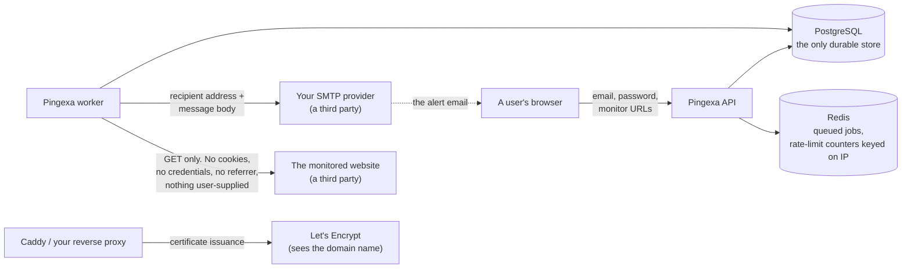

# Pingexa — Data inventory, and the hosted-service legal gap

Two different things get confused constantly, so this page separates them.

* **The source code licence** is [MIT](../LICENSE). That governs the software:
  anyone may use, modify and redistribute it. It is settled and complete.
* **A hosted service's Privacy Policy and Terms of Service** govern a
  relationship with the people who sign up for a *running instance*. They are
  not a licence, the MIT licence does not supply them, and publishing the
  source does not create them.

This document is a **factual inventory** of what a running Pingexa stores,
where it goes, and how long it lives. It is deliberately not a policy and not a
template.

> **This is not legal advice, and nothing here has been reviewed by a lawyer.**
> It exists so that a qualified review — or a policy generator, or your own
> counsel — has accurate facts to work from instead of guesses about the
> software.

---

## 1. The gap, stated plainly

**As of this commit, the application ships no Privacy Policy, no Terms of
Service and no cookie notice.** This was checked, not assumed:

* `apps/web/src/App.tsx` declares eleven routes plus a catch-all. None of them
  is `/privacy`, `/terms`, `/legal` or anything equivalent.
* No page in `apps/web/src/pages/` renders such a link — not the landing page,
  not the signup form, not the footer, not the public status page.
* Searching the whole repository for `privacy`, `terms of`, `cookie polic`,
  `GDPR` or `data protection` returns nothing but references to the public
  status page's data boundary — a source comment and two lines of
  test/acceptance notes.

**For the source code, this is not a problem.** The repository is licensed and
can be published as it stands.

**For the hosted instance at `https://pingexa.parthavix.com`, it is an open
launch gap**, because that instance:

* collects an email address and a password from members of the public,
* stores URLs those people chose to have watched,
* retains check and incident history about those URLs,
* sends them email,
* sets cookies in their browser,
* and passes their email address to a third-party mail provider.

Doing any of that for other people, under most privacy regimes, requires
telling them what is collected, why, for how long, who else sees it, and how to
get it deleted. None of that text currently exists.

**Anyone self-hosting Pingexa for other people inherits exactly the same gap**,
and becomes the data controller for their own instance.

### What has to happen before the hosted service takes public sign-ups

These are the repository owner's, and they need a qualified review — they are
not code changes this document can make:

1. **A Privacy Policy**, covering the inventory in §2–§5 below, the applicable
   jurisdiction(s), the lawful basis, and how to request access or deletion.
2. **Terms of Service**, stating at minimum that the service carries no uptime
   guarantee, that alert delivery is at-least-once and best-effort, that a
   missed alert carries no liability, and what a user may point a monitor at.
3. **A cookie notice**, or a reasoned position that one is not required. Pingexa
   sets no analytics or advertising cookies — see §4 — which usually makes this
   the short version, but it still has to be written down.
4. **A route to delete an account.** There is no self-service path today (see
   §6), which is a functional prerequisite for honouring a deletion request
   without a database console.
5. **A stated retention period**, consistent with the actual defaults in §3.
6. **A contact address** for data requests.

Until those exist, the honest options are: keep the hosted instance private to
the owner, or publish the documents. **Publishing the source is not blocked by
any of this.**

---

## 2. What is stored, field by field

Eight tables, from `apps/api/prisma/schema.prisma`. This is the complete set —
there is no second store, no analytics pipeline and no data warehouse.

### `users` — the account

| Field | Contains | Notes |
|---|---|---|
| `id` | UUID | |
| `email` | **the account email address** | Unique. The only identifier a person supplies about themselves. Alerts go only here, and only after it is confirmed. |
| `passwordHash` | Argon2id hash (19 MiB, 2 iterations) | The password itself is never stored and never logged. |
| `emailVerifiedAt` | timestamp or null | Monitoring and alerts are inactive until this is set. |
| `createdAt`, `updatedAt` | timestamps | |

**No name, no address, no phone number, no billing details, no profile
picture.** There is no billing system in the product at all.

### `sessions` — signed-in browsers

| Field | Contains | Notes |
|---|---|---|
| `tokenHash` | SHA-256 of a 32-byte random token | The token itself exists only in the user's cookie. |
| `createdAt`, `lastSeenAt`, `expiresAt`, `revokedAt` | timestamps | |
| `userAgentTag` | **truncated and hashed** user agent | Kept only so a person can recognise their own session. Not the raw string. |

**No IP address is stored on a session.**

### `auth_tokens` — email confirmation and password reset

Hashed, single-use, and expiring: 24 hours for confirmation, 1 hour for reset.
A new token invalidates the previous one. Spent tokens are deleted by retention.

### `monitors` — what the user asked to be watched

| Field | Contains |
|---|---|
| `name` | a label the user chose |
| `url` | **the URL the user asked to be monitored** — the most sensitive field in the product, because it can reveal a private or unlisted site |
| `state`, `paused`, `isPublic`, `slot`, `intervalSeconds` | state |
| `consecutiveFailures`, `failingSince`, `lastCheckedAt`, `lastResponseTimeMs`, `lastStatusCode`, `lastFailureKind`, `lastFailureReason` | last-check summary |
| `nextCheckAt` | the schedule |

### `checks` — the history

One row per scheduled check: `scheduledFor`, `startedAt`, `checkedAt`,
`outcome`, `statusCode`, `responseTimeMs`, `failureKind`, and a short sanitised
`failureReason`.

**No response body is ever stored.** The body of a monitored page is read only
far enough to enforce `MONITOR_MAX_RESPONSE_BYTES` and is then discarded — it
is never written to the database and never logged. No response headers are
stored either.

### `incidents` — outages

`startedAt`, `detectedAt`, `resolvedAt`, `closeReason`, and the cause
(`causeKind`, `causeReason`).

### `notifications` — alert delivery state

`kind` (DOWN/RECOVERY), `status`, `attempts`, `sentAt`, and **`lastError`** — an
SMTP diagnostic that can contain the provider's hostname and its raw server
reply. `lastError` is **never** sent to any API response, including the account
owner's; it exists for the operator's logs. It is the one field an operator
should treat as sensitive when sharing a database extract.

### `status_pages` — the shareable page

`slug` (32 hex characters of CSPRNG output), `title`, `published`. The slug is
the *only* access control on a published page, which is why the API answers
`Cache-Control: no-store` and the page carries `noindex, nofollow`.

---

## 3. How long it is kept

| Data | Default retention | Setting |
|---|---|---|
| Check rows | **7 days** | `CHECK_RETENTION_DAYS` |
| Resolved incidents | **90 days** | `INCIDENT_RETENTION_DAYS` |
| **Open** incidents | **never deleted**, however old | — |
| Expired and revoked sessions | removed by the same pass | `SESSION_TTL_DAYS` caps a live session at 30 days |
| Spent auth tokens | removed by the same pass | — |
| Account, monitors, status page | **until deleted** — there is no automatic expiry | — |
| Docker container logs | bounded at 5 × 10 MB per service by the shipped Compose files | — |

The retention pass runs every `RETENTION_INTERVAL_MS` (1 hour by default) and
once ten seconds after the worker starts.

**Deleting a monitor** cascades its checks, incidents and notifications
immediately. **Deleting a user row** cascades everything: monitors, sessions,
tokens, notifications and the status page. The cascade is correct and complete;
what is missing is a user-facing button for it (§6).

---

## 4. Cookies and browser storage

| Name | Type | Purpose | Lifetime |
|---|---|---|---|
| `pingexa_session` | cookie, **httpOnly**, `SameSite` per config, `Secure` in production | the session. Value is 32 random bytes; the server stores only an HMAC of it | `SESSION_TTL_DAYS` (30) |
| `pingexa_csrf` | cookie, **not** httpOnly, deliberately — the client must read it | CSRF double-submit token | session |
| `pingexa.theme` | `localStorage` | Light / Dark / System preference | until cleared |

That is the complete list.

**There are no analytics, advertising, or third-party cookies, and no
third-party scripts.** Verified: the built SPA loads no external fonts, no CDN
and no tracker — the only external requests the browser makes are to the origin
that served the page. `apps/web/public/` contains exactly one file, a favicon.

`pingexa.theme` is written only once a user actually picks a theme, so "System"
is a genuine default rather than a recorded decision, and blocked storage
degrades to applying the theme for that page view without remembering it.

---

## 5. Where data goes outside the database

Four external parties, and exactly what each one learns:

| Party | What it receives | Notes |
|---|---|---|
| **Your SMTP provider** | the recipient's email address, the subject and body of every message Pingexa sends | Unavoidable — it is how email works. Its own privacy terms apply on top of yours, and a hosted service must name it. |
| **Each monitored website** | a bare `GET` from your server's IP, with a fixed `User-Agent` (`MONITOR_USER_AGENT`), every 5 minutes | **No cookies, no `Authorization`, no `Referer`, and nothing the user supplied beyond the URL itself.** |
| **Let's Encrypt** | the domain name, when a certificate is issued or renewed | Only if you use automatic HTTPS. Certificates are published in public Certificate Transparency logs — so the hostname of your instance is public, by design of the web PKI. |
| **Your hosting provider** | everything on the disk and in transit to it | Whoever runs the machine. |

**No data is sent to the Pingexa maintainer from a self-hosted instance.** There
is no telemetry, no phone-home, no update check and no crash reporting.

### What the logs contain

Application logs are structured JSON via pino. The HTTP request serializer
emits **only** `{ method, url, id }` and `{ statusCode }` — verified in
`apps/api/src/http/app.ts`. **Client IP addresses and user-agent strings are
not written to the application log.**

Redacted by key name, at any depth: `password`, `passwordHash`, `newPassword`,
`currentPassword`, `token`, `tokenHash`, `sessionToken`, `csrfToken`, `secret`,
`authorization`, `cookie`, `set-cookie`, **`slug`**, `body`, `responseBody`,
plus the `cookie` and `authorization` request headers and the `set-cookie`
response header. In production, error stacks are kept out of the log payload.

Two honest caveats:

* **IP addresses are processed, transiently.** Rate limiting keys on the client
  IP, and those counters live in Redis for the length of the window
  (15 minutes at most, by default). They are not written to Postgres and not
  written to the log.
* **Neither shipped Caddyfile enables an access log**, so client IPs are not
  recorded at the proxy either. If you add a `log` directive — or put your own
  nginx in front — you are introducing an IP log, and your policy has to say so.

---

## 6. Gaps a reviewer should know about

| Gap | Detail |
|---|---|
| **No self-service account deletion** | Deleting a `users` row cascades everything correctly, but there is no button for it. Honouring a deletion request today means a database console. This is a functional prerequisite for a compliant hosted service. |
| **No data export** | There is no "download my data" endpoint. The data is small and legible in SQL, but a subject access request needs manual work. |
| **No audit log** | Who changed what, and when, is not recorded beyond `updatedAt`. |
| **Retention is global, not per-account** | 7 and 90 days apply to every account; there is no per-user setting. |
| **Alert email is at-least-once** | A user can receive a duplicate alert. Terms should not promise exactly-once, and should not promise delivery at all — Pingexa can prove only that a provider *accepted* a message. |
| **No bounce processing** | A hard bounce after acceptance is invisible. An address that has gone dead keeps being mailed until the attempt budget is spent per alert. |
| **Monitored URLs are as sensitive as the user makes them** | A URL can itself contain a secret (an unlisted path, a token in a query string). Pingexa stores it in full and shows it to its owner, never on a public status page — but an operator with database access can read it. |

---

## 7. What Pingexa already does well here

Worth stating, because a policy review should not have to rediscover it:

* **The public status page cannot leak.** Its projection is a single function
  that never receives or emits the monitored URL, the owner's email, HTTP status
  codes, failure reasons or the slug. Integration tests assert nine forbidden
  strings are absent from the response, and an end-to-end test asserts against
  the rendered HTML.
* **Revocation is immediate.** `Cache-Control: no-store`, so unpublishing a page
  or rotating its slug takes effect at once rather than after a cache window.
* **A published status page is `noindex, nofollow`**, so a link shared with a
  handful of people does not become publicly discoverable.
* **Another user's resource returns `404`, never `403`**, so an id cannot be
  probed for existence.
* **Nothing a user supplies is forwarded to a monitored site** — no cookies, no
  credentials, no custom headers.
* **Response bodies are never stored or logged**, only measured.
* **Passwords are Argon2id**, sessions are opaque and stored only as an HMAC,
  and a password reset revokes every session.

---

## 8. If you self-host for other people

You become the data controller for your instance. At minimum:

* Write your own privacy policy and terms; do not reuse the maintainer's, and
  do not assume this document is one.
* Name your SMTP provider in it — your users' email addresses go there.
* Decide and state a retention period, and set `CHECK_RETENTION_DAYS` and
  `INCIDENT_RETENTION_DAYS` to match what you wrote.
* Put a contact address for data requests somewhere your users can find it.
* Have a manual procedure for deletion until there is a UI for it (§6).
* Set `MONITOR_USER_AGENT` to something that identifies your instance, so a
  site owner who sees your checks can reach you.

See [`SELF_HOSTING.md`](SELF_HOSTING.md) §11.

---

## 9. Related

| | |
|---|---|
| The source licence | [`LICENSE`](../LICENSE) |
| Reporting a vulnerability | [`SECURITY.md`](../SECURITY.md) |
| The data model in full | `apps/api/prisma/schema.prisma` |
| How the boundary is enforced | [`ARCHITECTURE.md`](ARCHITECTURE.md) §6 |
| Known limitations | [`HANDOVER.md`](HANDOVER.md) §13 |
